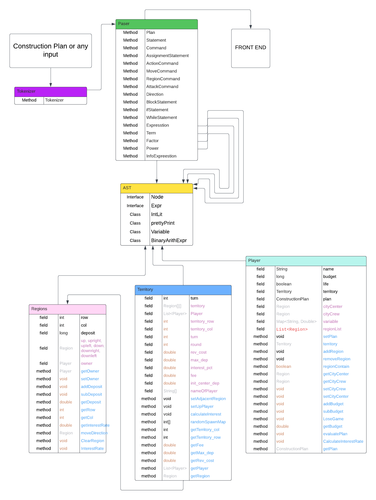

# **UPBEAR_Game OOP Project**

## **An overview of your server–client implementation**
เริ่มแรก จะให้ผู้เล่นใส่ชื่อและสร้าง Config File ที่เป็นห้องของตัวเกมส์ จากนั้นจะทำการยิง API ไปหลังบ้านเพื่อให้สร้าง Map ของเกมส์และส่งกลับมาให้หน้าเว็บ ถ้าผู้เล่นอยู่ในเกมส์แล้ว จะทำการส่ง Construction Plan ที่เป็น String ไปให้หลังบ้าน หลังจากการประมวลผลของ Construction Plan นั้น ๆ แล้ว ก็จะทำการดำเนินการต่าง ๆ เช่น shoot, relocate, move แล้วส่งมาแสดงผลบนหน้า UI

## **Architecture**
### **module dependency diagram**

### **Design patterns**
- Factory pattern
    - ใช้ใน class Territory ใน randomSpawnMap() โดยรวมการสร้างโลจิกในการสุ่มตำแหน่ง spawn
- Observer pattern
    - ใช้ใน class Player ทำหน้าที่เป็น subject ที่ observes state ต่าง ๆ ของเกม แล้วเปิดการทำงานต่าง ๆ เช่น evaluatePlan() ตามการเปลี่ยนแปลง ทำให้จัดการ game state ได้ง่ายขึ้น

### **Rep Invariants**
- **Player Class:**
    - ตรวจสอบให้แน่ใจว่างบประมาณของ player จะไม่สามารถเป็นค่าที่ติดลบได้
    - จัดการ regions ที่ player เป็นเจ้าของ
- **Region Class:**
    - ควบคุม row และ column อย่างถูกต้อง
    - ตรวจสอบให้แน่ใจว่า deposit จะไม่สามารถเป็นค่าที่ติดลบได้
    - ตรวจสอบให้แน่ใจว่าเจ้าของ region ถูกต้อง
- **Territory Class:**
    - ตรวจสอบให้แน่ใจว่าจำนวนเงินที่ถอนจาก region ทั้งหมด อยู่ในขีดจำกัดที่กำหนดไว้
    - ตรวจสอบให้แน่ใจว่าขอบเขตไม่ใช่ค่าลบและมีความสมเหตุสมผลสำหรับ row และ column
    - ตรวจสอบให้แน่ใจว่า player เป็นเจ้าของ region

## **Code Design:**
**Data Structures**
- Array 2D ในการเก็บ Region แต่ละอันโดยมีขนาดตาม Map m * n
- Map เอาไว้เก็บตัวแปล ต่างๆที่เกิดขึั้น ใน Construction String ———> double
- List เอาไว้เก็บว่ามี Player กี่คนและเอาไว้เก็บข้อมูลที่ใส่มาใน Construction plans

**Tradeoffs**
- โดยภาพรวม เราเก็บ Region เป็น Array ทำให้สามารถเข้าถึงได้ง่าย และเขียน Code ในการทำง่าย
- เเต่อาจจะทำให้ Code เขียนยากขี้นเล็กน้อยในการเดินระหว่าง Region และข้อมูลมีการเก็บที่แยกกันทำให้ตอนที่จะใช้อาจจะ ยุ่งยากในการเขียน Code

## **Tools:**
- Notion วางแผนกำหนดการและการทำงาน
- Discord ใช้ติดต่อสื่อสารกับสมาชิกในกลุ่ม
- IntelliJ IDEA ใช้สำหรับการ coding
- Github ใช้สำหรับการอัพเดท Code ของ Project
- Spring Framework
- Postman เช็ค API
- Lucid chart เอาไว้ทำ module dependency diagram

## **What did your group learn from designing and implementing parts**
เราควรวางแผนในแต่ละส่วนให้ดีก่อนเริ่มต้นการทำงาน เพื่อให้การทำงานเป็นไปได้อย่างราบรื่นและลดโอกาสที่จะเกิดปัญหาต่าง ๆ ลง เช่น การวางแผนว่าจะใช้อะไรในการเก็บผู้เล่น เก็บ city center จะทำการ Parse อย่างไร จะออกแบบ UI อย่างไรให้ดูน่าสนใจ 

# **Testing**
## Expr Test
ในการ test `BinaryArithExprTest` เราได้ทำการทดสอบโดยการสร้าง `setUpGame` เพื่อจำลองโครงสร้างของเกม แล้วนำมา test โดยส่วนแรก เราได้ test การคำนวนบวก ลบ คูน หาร mod ยกกำลัง หารศูนย์
โดย variable ที่เราใช้ในการ test จะมี 0, 1, -1, 1000, 1001, -1000, -1001 

- `Plush()` test การบวก
- `SubT()` test การลบ
- `MutiP()` test การคูณ
- `Divi()` test การหาร
- `ModPer()` test การมอด
- `Power()` test การยกกำลัง
- `DivisionByZero()` test การหารด้วย 0
- `CombinationOfOperations()` test การใช้หลาย Operations
ส่วนที่สอง เราได้ทำการ testConstructionPlan โดยการจำลอง setUpGame แล้วนำ Construction Plan มา test เช่น t = t + 5 , ("d = deposit / 4") , dir = random แล้วดูค่า expected ว่าตรงกันไหม
## Construction Plan Parser Test
`ConstructionPlanParserTest` เราจะจำลองการเล่นโดยให้ Run `Construction Plan` ที่ได้จากหน้าเว็บที่ผู้เล่นส่งเข้ามา แล้วลอง Parse และ Evaluate ดู output ว่ามันทำงานตามนั้นไหม 
ส่วนแรกเป็นการ Test ที่ผู้เล่นจะมี action เช่น shoot, move, invest, relocate, deposit โดยทดสอบแยกๆกันและอีกส่วนหนึ่งเป็นการ Test Statement เช่น if else , while , statement , block statement โดยมี Statement อยู่ด้านในเป็น action ที่เป็นเช่น shoot, move, invest, relocate, deposit ด้านใน รวมถึงเป็น block statement ที่มีหลาย action โดยดู output ที่ออกมาว่าถูกต้องตามที่ควรเป็นตาม Project specifications หรือป่าว

จากการทำ testing ทำให้เราได้เรียนรู้ว่าควรมี test cases อะไรบ้างที่จะทำให้ครอบคลุมงานของเรา โดยต้องอาศัยความอดทนในการแก้ไข test case ที่มีปัญหาไปทีละจุด เพื่อป้องกัน Bug ที่สามารถเกิดขึ้นได้ในอนาคต

